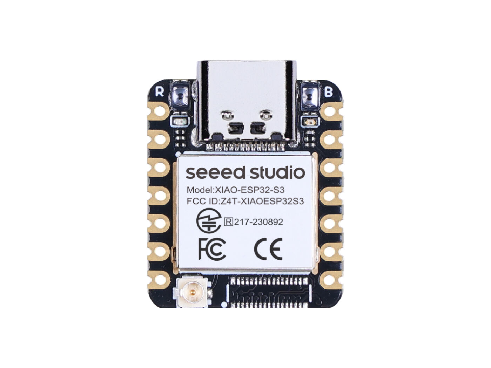
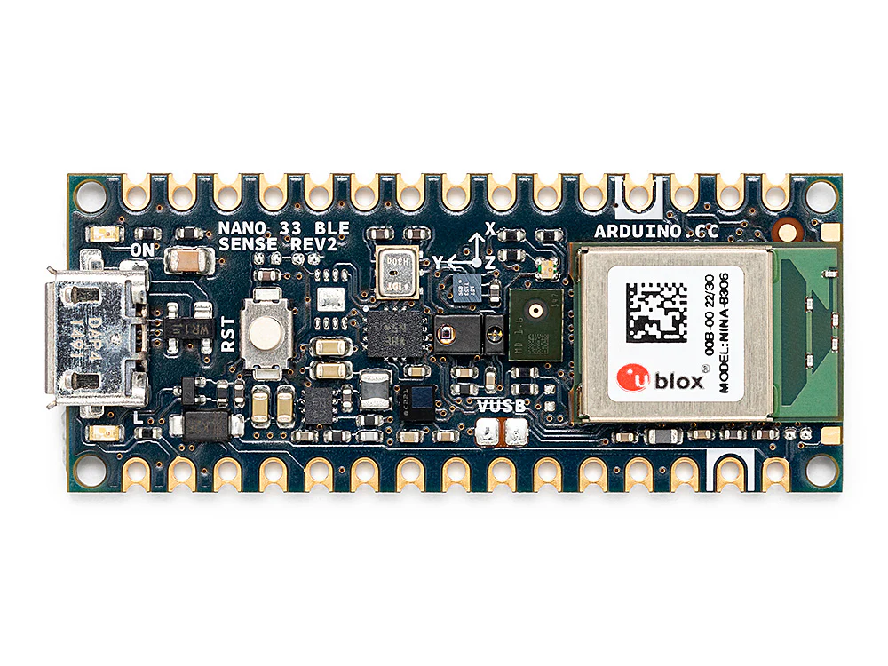
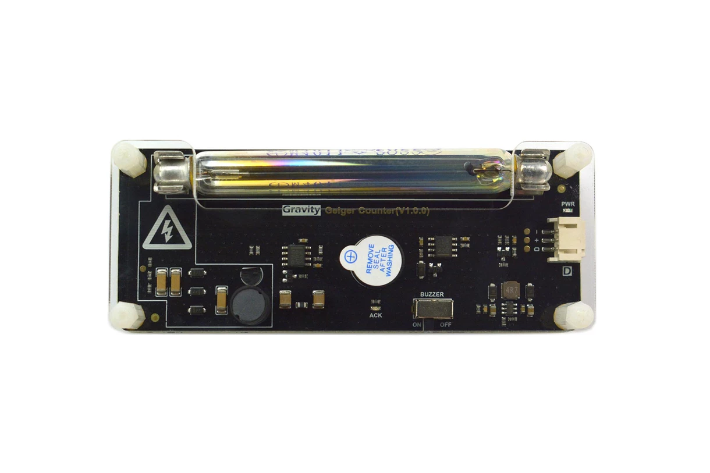
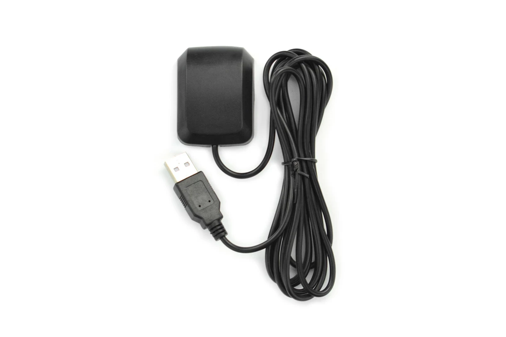

# Components

## Main Compute Units 

- **Odroid N2+**

  

- **XIAO ESP32 S3**
  
   

- **Arduino Nano 33 BLE** 
  
  

## Sensor Modules

- **DFRobot SEN0463** 
  
   

- **Ozone Sensor** 
  
  

- **GPS Module** 
  
  

  

