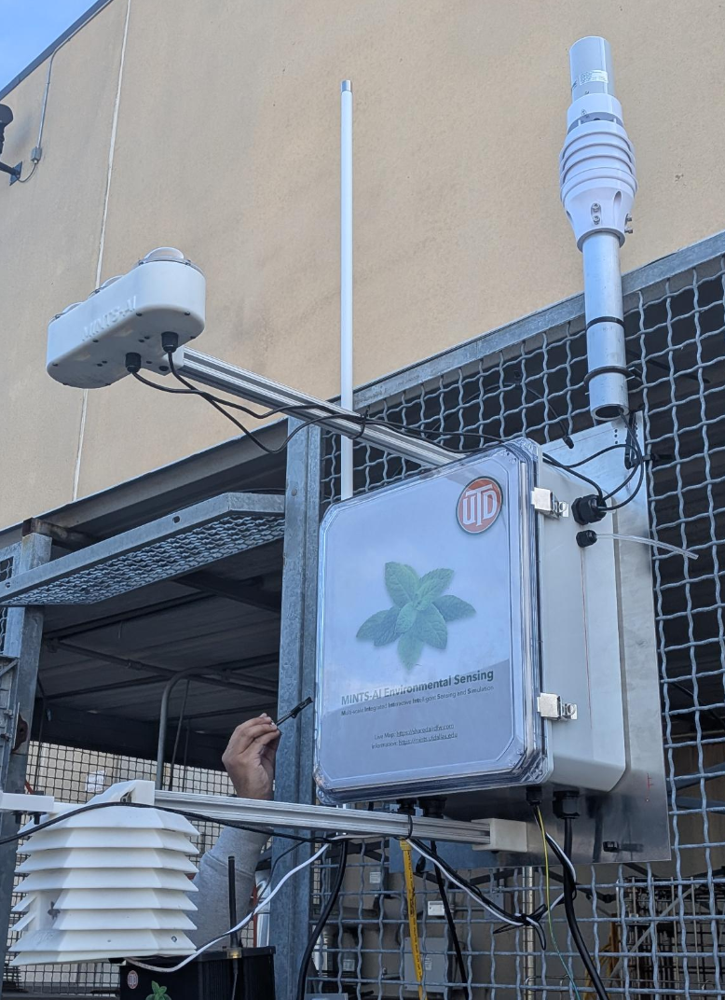
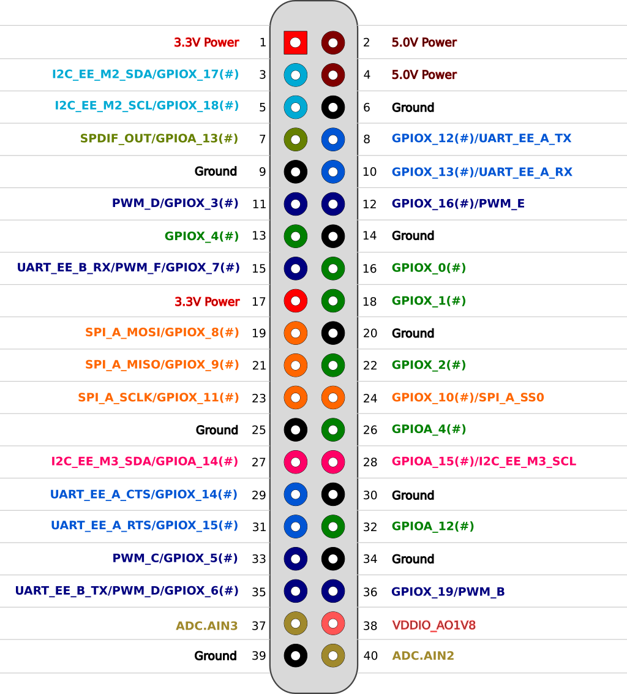

# CANOPY Community Avian and AirQuality Network for Observing Pollution Year-round
Contains firmware for the Community Avian and AirQuality Network for Observing Pollution Year-round(CANOPY)

## Suggested Framework 

### 📋 Summary
This system design leverages an **Odroid** as a powerful Edge IoT node, integrating local data collection, processing, and resilient cloud synchronization. All local services and custom sensor readers are managed via **Git repositories** for version control and streamlined deployments. The system ensures continuous operation during internet outages by storing data locally and syncing to the cloud when connectivity is restored, while also publishing live data to the cloud via MQTT.

---

## Electrical Data Parts List
- **Raspberry Pi Zero 2W** (on [Dream V2.0 PCB Board](https://github.com/mi3nts/PCBMints2025) or later)
    - OPC-N3 
    - SJH-5A Methane Sensor (Not working on Dream V2.0 or earlier)
    - BME280 
    - IPS7100
    - COZIR AH-E-1
- **2x Odroid N2**
    - RS-FSXCS Anemometer
    - AS7265X
    - LTR390
    - SEN0463 Radiation sensor
    - 2x G-MOUSE USB GPS
    - USB Camera
    - USB Microphone
- **2x Arduino Boards**
    - One for managing the relays (receives input from odroidHeartbeat.py)
        - Ensure step up to 5V if board outputs 3.3V
    - One for digitalizing analog outputs from SEN0463

---

## Data Management
- **Git-Managed Dockerized Sensor Readers**: Python containers pulled from Git, reading sensors and publishing data via MQTT.
- **Git-Managed Local Services**:
  - **Mosquitto (MQTT Broker)**: Manages local messaging.
  - **Node-RED**: Handles data routing, automation, and local storage to InfluxDB.
  - **InfluxDB (Local)**: Buffers time-series data at the edge.
  - **Telegraf**: Continuously syncs local InfluxDB data to Cloud InfluxDB.
  - **Grafana**: Provides edge visualization for real-time monitoring without relying on cloud access.
- **Cloud Backend**: Centralized Node-RED, InfluxDB, and Grafana for real-time processing, long-term storage, and visualization.

---

### 🌐 Data Flow
1. Sensors connected to Odroid are read by Dockerized Python sensor readers deployed from Git - The current repo.
2. Sensor data is published to:
   - **Local MQTT Broker** for edge processing.
   - **Cloud MQTT Broker** for real-time cloud ingestion.
3. Node-RED (Edge) subscribes to local MQTT, processes data, and stores it in local InfluxDB.
4. Telegraf syncs buffered data from local InfluxDB to Cloud InfluxDB.
5. Cloud Node-RED and Grafana handle advanced workflows and visualization.

---

### 🛡️ Key Features
- **Git-Managed Deployments**: Version control for all services and sensor readers.
- **Offline Resilience**: Full functionality without internet.
- **Live Data Streaming**: Real-time data published to cloud via MQTT.
- **Automated Cloud Sync**: Telegraf ensures data consistency between edge and cloud.
- **Modular & Scalable**: Docker-based deployment for easy management.
- **Flexible Automation**: Node-RED enables custom logic and integrations.

---

## 🚀 Deployment Steps
1. Clone Git repositories for local services and sensor readers.
2. Deploy Docker Compose stack on Odroid (MQTT, Node-RED, InfluxDB, Telegraf, Grafana).
3. Run sensor reader containers from Git.
4. Configure Node-RED flows for data handling.
5. Set up Telegraf for continuous cloud sync.
6. Deploy local Grafana for edge-based dashboards and visualization.
7. Access cloud Node-RED and Grafana for real-time monitoring and dashboards.

### Odroid N2 Pinout Connection
- **Connection for 1B
- 

